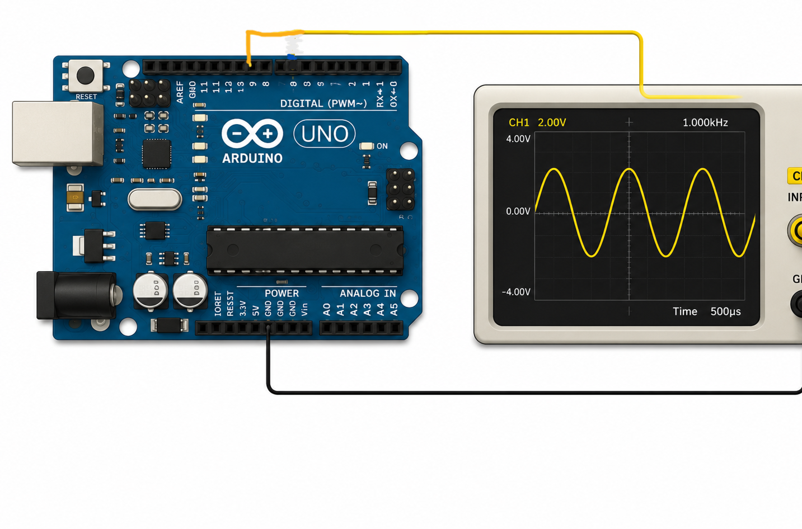
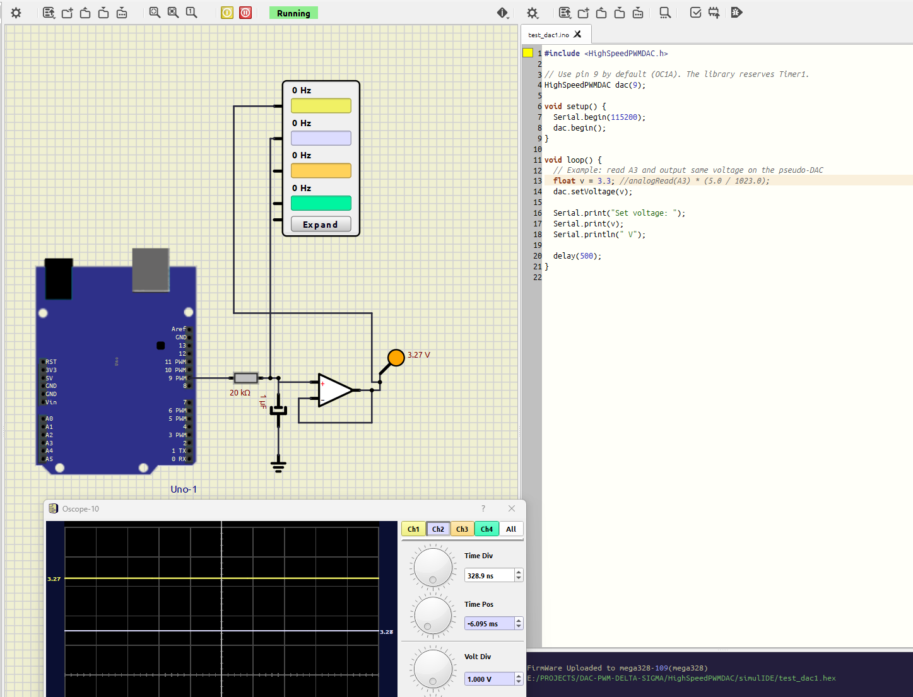
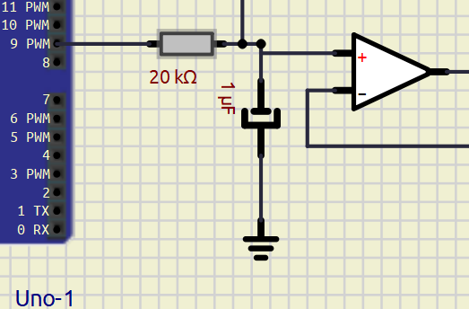
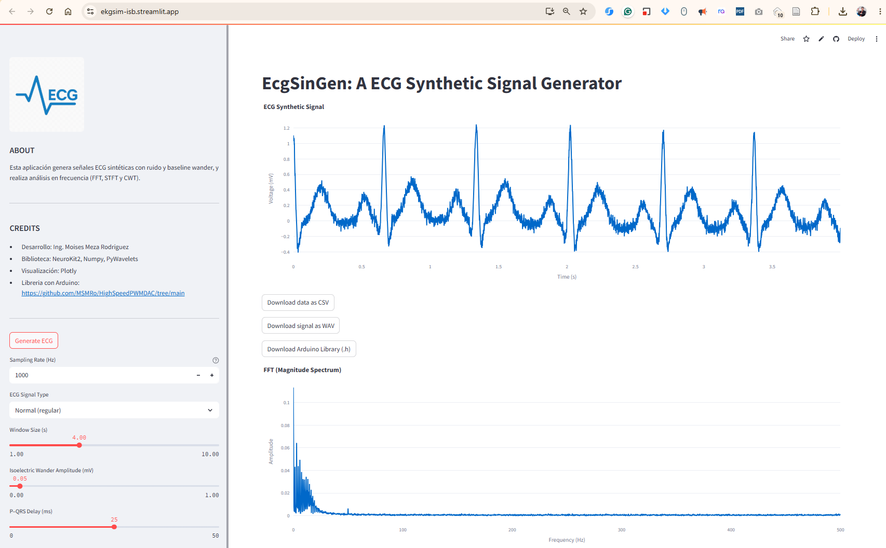
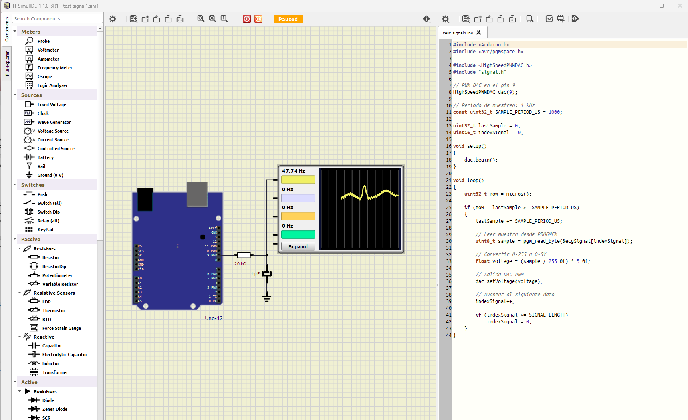
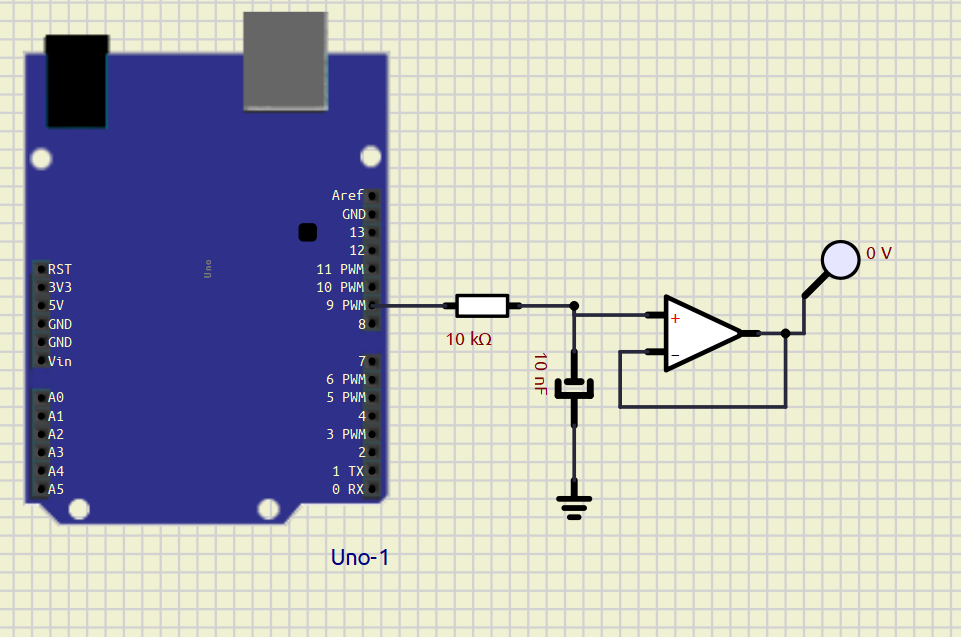

# HighSpeedPWMDAC
================



A  Arduino library to generate a PWM-based pseudo-DAC on Arduino Uno (ATmega328P) using Timer1 (OC1A / Digital Pin 9) configured as 10-bit Fast PWM (≈ 15.625 kHz, no prescaler).

Features
- Configure Timer1 for Fast PWM 10-bit and use OCR1A (pin 9) as a pseudo-DAC output
- API to set voltage (float, clamped to 0..Vcc) or raw 10-bit value (0..1023)
- release() helper to disconnect Timer1 when needed (affects all Timer1 usage)


La diferencia de este DAC es de solo 0.03 v, lo cual para pruebas esta bien. Se recomienda colocar el OPAMP modo seguir emisor para garantizar que la impedancia del circuito externo pueda afectar.




## Custom signal generation
To generate your own signal, one way is to use:
- web for creating EKG signals: https://ekgsim-isb.streamlit.app/




This web site may create ekg singal for including in this library. There you can find a button called ```Download Arduino Library (.h)```, where is possible to download a file .h like this:
```c
#ifndef SIGNAL_H
#define SIGNAL_H

#include <Arduino.h>
#include <avr/pgmspace.h>

const uint16_t SIGNAL_LENGTH = 4000;

const uint8_t ecgSignal[SIGNAL_LENGTH] PROGMEM = {
205,201,218,214,221,221,202,191,180,169,160,132,121,105,113,92,
.
.
.
.
162,160,160,164,163,149,180,183,169,203,193,206,190,177,188,173,
153,129,119,108,99,62,61,54,52,34,54,54,65,69,77,74,
79,82,84,75,57,52,42,21,16,22,0,10,19,12,32,64

};

#endif

```

- The complete file is here [signal.h](./examples/test_signal1/signal.h)
- The arduino code is here [test_signal1.ino](./examples/test_signal1/test_signal1.ino)
- The SimulIDE projects is here: [test_signal1.sim1](./simulIDE/gen_signals/test_signal1.sim1)




## Important: Timer1 reservation and conflicts
-------------------------------------------
This library directly configures Timer1 registers (TCCR1A/TCCR1B) and writes OCR1A. The Arduino Uno uses Timer1 for several common tasks and libraries (for example: tone() with certain pins, servo libraries that use Timer1, and PWM on pins 9/10). Using this library will therefore conflict with any other code that expects Timer1 to remain unchanged.

Recommendations:
- Only use this library when you can dedicate Timer1 to the pseudo-DAC.
- If another library in your sketch also needs Timer1, choose a different approach or avoid using this library.
- Call HighSpeedPWMDAC::release() if you need to stop the DAC and restore Timer1 to a clean state — note that release() simply zeros the Timer1 control registers and will not restore any previous Timer1 configuration.

## Hardware: RC filter at PWM output
---------------------------------
The PWM output is a high-frequency square wave (~15.625 kHz when using 16 MHz clock and 10-bit Fast PWM with no prescaler). To convert the PWM into a smooth analog voltage, use a low-pass RC filter. Choose the RC cutoff (fc) low enough to strongly attenuate the PWM fundamental (15.6 kHz) but high enough to preserve the intended analog bandwidth.

Formula:

  ```fc = 1 / (2*pi*R*C)```

Example recommended starting values (tradeoff between ripple and response time):
- Option A (higher input impedance): R = 10 kΩ, C = 10 nF -> fc ≈ 1.59 kHz
- Option B (faster response, lower source impedance): R = 1 kΩ, C = 100 nF -> fc ≈ 1.59 kHz
- Option C (more smoothing, slower response): R = 10 kΩ, C = 100 nF -> fc ≈ 159 Hz

Guidelines:
- Aim for fc around 1/10..1/20 of the PWM frequency for good attenuation of the PWM ripple. For PWM ≈ 15.6 kHz, fc ≈ 780 Hz..1.56 kHz is a reasonable starting range.
- Increasing R or C lowers fc (less ripple, slower response). Lowering R or C raises fc (more ripple, faster response).
- If you drive a low impedance load, use a buffer amplifier (op-amp configured as a voltage follower) after the RC filter or choose R small enough to source the load current — but beware of increasing supply ripple and loading the PWM pin.
- Add a series resistor between the pin and the RC network (e.g., 1 kΩ) to limit peak currents and reduce switching noise.

Practical wiring
- Connect Digital Pin 9 (PWM, OC1A) to the resistor R (1 kΩ suggested), other side of R is the filter node Vout.
- Connect capacitor C from Vout to GND.
- Measure your final analog voltage at Vout (the junction between R and C).
- Optionally buffer Vout with an op-amp if driving low impedance loads or to reduce load-related effects.



Estimating ripple
- Roughly, PWM ripple magnitude depends on duty-cycle, RC time constant and PWM frequency. Using fc << fPWM reduces ripple amplitude significantly. If you need a quantitative ripple estimate, simulate or compute the RC step response for your PWM duty cycle and frequency.

Notes and caveats
- This library assumes the board Vcc ≈ 5.0 V. If using a different Vcc, adjust expectations accordingly or modify the code to read Vcc from the MCU (e.g., using the internal bandgap reference) and update behavior.
- The release() method clears Timer1 registers but does not restore previous Timer1 settings. If you need to preserve a pre-existing Timer1 configuration, capture registers before begin() and restore them later in your sketch.


License
-------
Use as you wish. No warranty.
